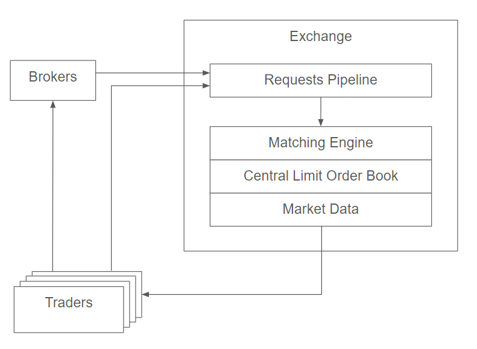
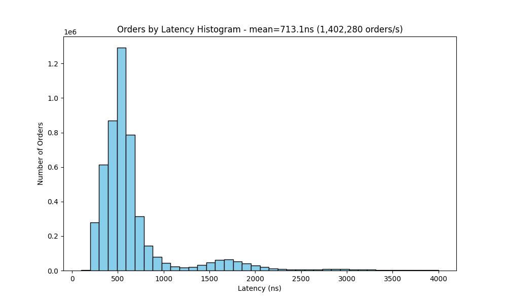
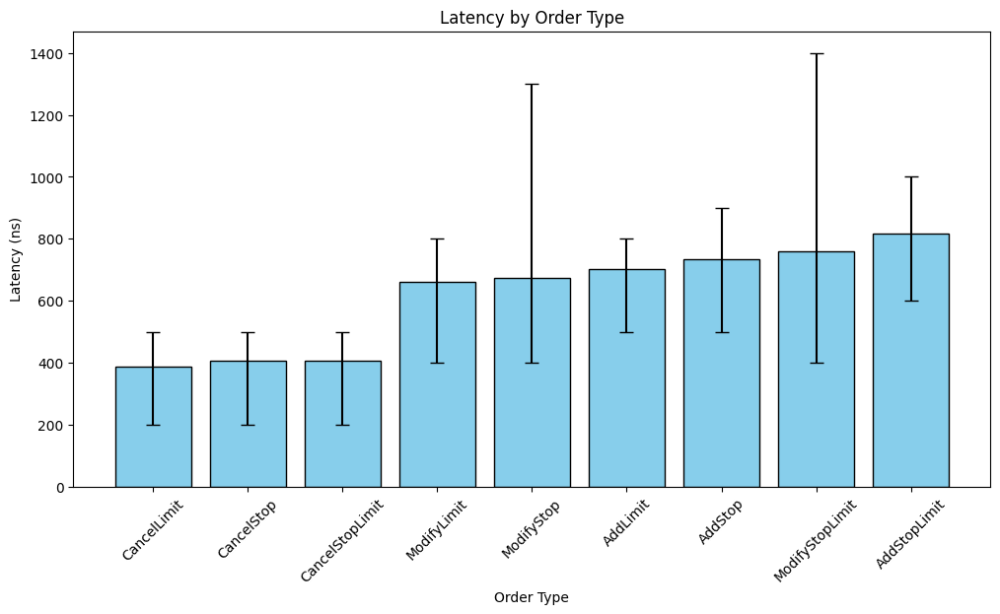
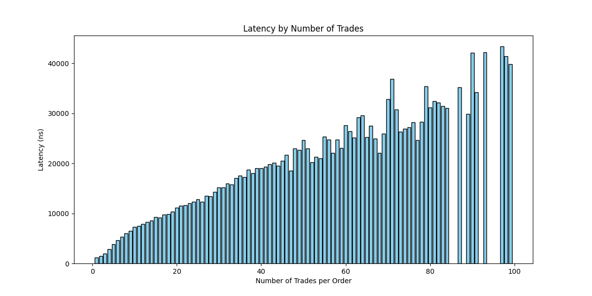
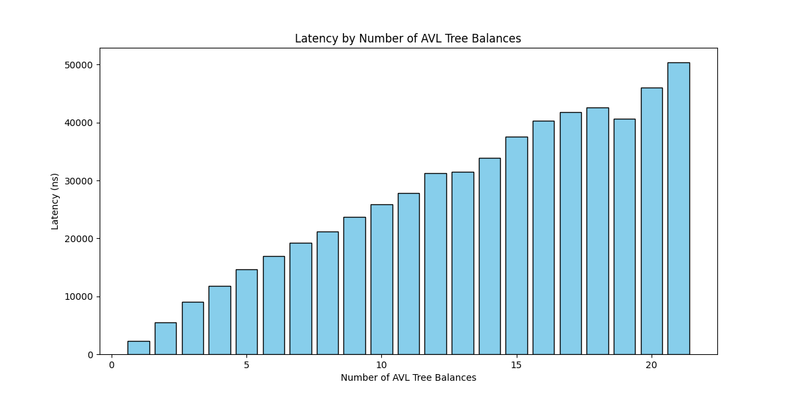
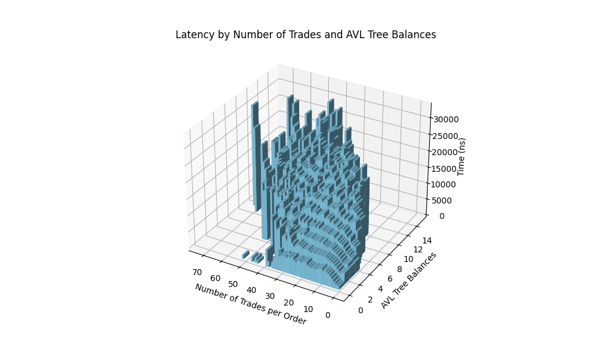

# Limit Order Book

This Limit Order Book is developed in `C++` from scratch and able to handle over 1,400,000 TPS (transactions per second), including Market, Limit, Stop and Stop Limit orders. 

Performance testing of the order book was also quite a challenging task as it required getting order data for testing, performing the testing to collect latency statistics, and finally analysing and visualising the collected data. All functionality testing was completed thorough a set of unit tests and integration tests using `GoogleTest`.

## Background

### Matching Engine




The matching engine is the core component of trading systems such as stock exchanges. It serves as the intersection where buyers' and sellers' interests meet, enabling trades through order matching. The matching engine maintains a limit order book, which consists of all orders that have not yet been matched. The matching process for trading instruments is inherently sequential. While requests from traders or brokers can be processed concurrently before entering a single queue in the requests pipeline, the sequential nature of the matching process makes the matching engine the throughput bottleneck of the exchange. Consequently, the number of requests an exchange can handle per second is constrained by the throughput of the matching engine and order book, thus explaining the desire for a low latency system. Additionally, the exchange is responsible for disseminating market data, including trade executions and order book updates, to the traders.

The matching engine uses a `FIFO` (First In, First Out) and `Price Priority` algorithm to determine the execution order of entries in the limit order book.

### Order Types

This limit order book supports all common order types usually available in trading systems. This includes:
- Market Order - Orders to buy or sell at the best market price.
- Limit Order (Add, Modify & Cancel) - Orders to buy or sell at the defined limit price and that does not produce trades instantly.
- Market Limit Order - Limit orders that cross the limit order book and produces trades.
- Stop Order (Add, Modify & Cancel) - Orders that are converted into a Market order when the current market price crosses their stop price. 
- Stop Limit Order (Add, Modify & Cancel) - Orders that are converted into a Limit order when the current market price crosses their stop price. 

## Project Tree

```
Limit_Order_Book/
├── Limit_Order_Book/   *files that make up Limit Order Book
│ ├── Book.cpp
│ ├── Book.hpp
│ ├── Limit.cpp
│ ├── Limit.hpp
│ ├── Order.cpp
│ └── Order.hpp
├── Generate_Orders/    *files to generate sample order data
│ ├── GenerateOrders.cpp
│ ├── GenerateOrders.hpp
│ ├── initialOrders.txt
│ └── orders.txt (removed because file size too large)
├── Process_Orders/     *files to process sample order data
│ ├── OrderPipeline.cpp
│ ├── OrderPipeline.hpp
│ ├── data_visualisation.py
│ └── order_processing_times.csv
├── test/               *unit tests
│ ├── CMakeLists.txt
│ ├── ExampleOrdersTests.cpp
│ └── LimitOrderBookTests.cpp
├── figures/
├── googletest/
├── main.cpp
├── .gitignore
├── CMakeLists.txt
└── README.md
```

## Architecture


```cpp
Order
    int idNumber;
    bool buyOrSell;
    int shares;
    int limit;
    Order *nextOrder;
    Order *prevOrder;
    Limit *parentLimit;

Limit  // representing a single limit price
    int limitPrice;
    int size;
    int totalVolume;
    Limit *parent;
    Limit *leftChild;
    Limit *rightChild;
    Order *headOrder;
    Order *tailOrder;

Book
    Limit *buyTree;
    Limit *sellTree;
    Limit *lowestSell;
    Limit *highestBuy;
    Limit *stopBuyTree;
    Limit *stopSellTree;
    Limit *lowestStopBuy;
    Limit *highestStopSell;
```

The idea is to implement a binary tree of `Limit` objects sorted by `limitPrice`, each containing a doubly linked list of `Order` objects. Each side of the book, the buy limits and the sell limits, should be in separate trees. This structure ensures that the inside of the book corresponds to the end of the buy limit tree and the beginning of the sell limit tree. Pointers to the `highestBuy` and `lowestSell` allow for quick retrieval of relevant orders during order matching.

Each order is also stored in a map keyed by `idNumber`, and each limit is stored in a map keyed by `limitPrice`. Buy and sell limits can share the same hash map, as they will be at opposite ends of the table (apart from orders that cross). Additionally, two more binary trees and a map keyed by `stopPrice` are required to store the buy and sell stop and stop-limit orders, with corresponding pointers to the `lowestStopBuy` and `highestStopSell`. All stop and stop-limit orders at a given node in these binary trees are executed if an order is executed at or beyond the node's stop price.

With this structure, you can efficiently implement the following key operations:

- Add Order – O(log M) for the first order at a limit, O(1) for all others, where M is the number of price Limits (generally << N the number of orders).
- Cancel Order – O(1)
- Modify Order – O(1)
- Execute – O(1)
- GetVolumeAtLimit – O(1)
- GetBestBid/Offer – O(1)

The binary trees are AVL trees, ensuring they remain balanced. This is crucial because market conditions frequently involve removing orders from one side of the tree while adding them to the other. To maintain O(1) performance for `GetBestBid/Offer`, it is important to update `lowestSell`/`highestBuy` in O(1) time when a limit is added or deleted, which necessitates that each Limit object has a pointer to its parent (`Limit *parent`).

Assumptions:
- Order shares are greater than 0.
- Limit and stop prices are greater than 0.
- Order ID numbers are unique.

## Testing & Performance


### Testing Data

To conduct testing, we need appropriate data. I developed a data generator that produces requests for the matching engine based on statistical models, using a slightly modified version of the limit order book itself. The test data sample consists of 5,000,000 requests, starting with an initial 11,000 orders to populate the limit order book. Order prices follow a normal distribution centered at 300 with a standard deviation of 50. Initially, all buy orders are below 300, and all sell orders are above 300, but the center of the book shifts according to the generated data.

The average number of active limit orders for the test data is 10,000, and the average number of active stop or stop-limit orders is 1,000. The proportions of the different types of orders are illustrated in the pie chart below.


### Latency Results

To measure throughput, I recorded the timestamps for each request as it entered the matching engine and once the matching engine had finished all resulting operations. The latency for processing a single request was calculated as the difference between the two timestamps. I conducted the test on an Intel i5-12450H (2.00 GHz) processor.



Above is a histogram illustrating the latencies for all 5 million orders. The average latency is 713ns per order, resulting in around 1.4 million orders per second.



The next figure shows the mean latency for different order types that did not result in trades (i.e., not market or market limit orders). The error bars represent the 15th to 85th percentiles of orders. Canceling orders was the quickest, averaging 400ns, while modifying and adding orders took slightly longer, around 700ns. Interestingly, actions involving stop limit orders took slightly longer, and modifying stop and stop limit orders exhibited larger variance.



The figure above shows how latency was affected by the number of trades resulting from a market or market limit order. A total of 845,242 trades were executed during the test. For each data point, the mean latency for that number of executed trades was calculated. The data stops following a consistent trend at higher numbers of executed trades due to fewer data points. There is a clear positive correlation between latency and the number of trades executed, showing that for each additional trade, latency increases by approximately 440ns. Only values with over 5 data points were used to limit the influence of random variation (this is also true for the remaining two other graphs).



Another key factor affecting latency was the number of AVL tree rebalances required after each order. This occurred when a limit/stop/stop limit order was added at a new price level, an order was canceled leaving the price level empty, or, most commonly, when a market or market limit order triggered multiple stop orders. Over the test, there were 252,504 AVL tree rebalances. The figure above shows that each tree rebalance significantly increased latency, averaging 2500ns per additional tree rebalance.



Since the number of executed orders and AVL tree rebalances are linked, as more trades being executed trigger more tree rebalances, it is important to plot both factors in one graph to determine which factor most contributes to increasing latency. The figure above, shows that more trades being executed does correlate to move AVL tree rebalances, due to no data in the bottom left and top right quadrants, and that both factors isolated do in fact increase latency. However, AVL tree rebalances have a more significant impact on latency, with each extra rebalance clearly increasing latency.

### Conclusion

This limit order book can handle over 1.4 million orders per second by utilizing an architecture focused on efficient data structures to support high-frequency trading (`HFT`). The results suggest that the number of orders per second could be further increased by reducing the number of required AVL tree rebalances. Additionally, using a faster CPU should also significantly improve performance.

## References

[How to Build a Fast Limit Order Book - wkselph](https://web.archive.org/web/20110219163448/http://howtohft.wordpress.com/2011/02/15/how-to-build-a-fast-limit-order-book/)

[Millions of Orders per Second Matching Engine Testing - Alex Zus](https://habr.com/en/articles/581170/)
